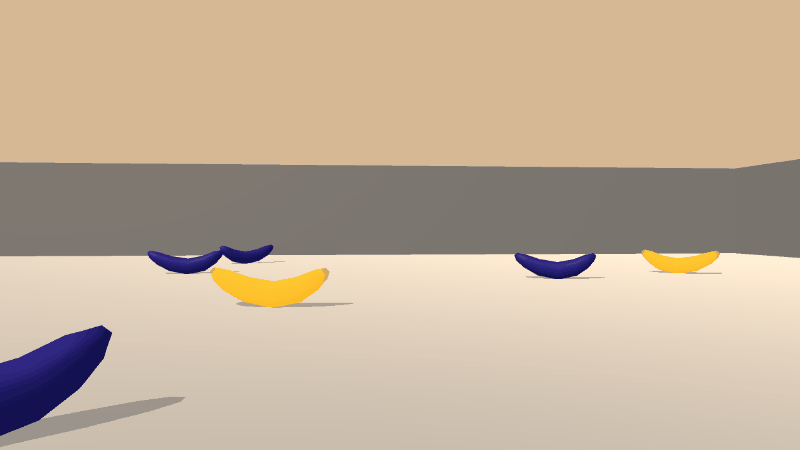
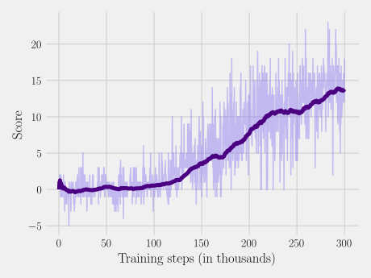

## Navigation

This repository contains an implementation of a reinforcement learning agent for a modified version of the "Banana Collectors" environment (provided by Udacity, see their [Deep Reinforcement Learning Nanodegree Program](https://www.udacity.com/course/deep-reinforcement-learning-nanodegree--nd893)) from the v0.3 version of the [Unity Machine Learning Agents Toolkit](https://github.com/Unity-Technologies/ml-agents). The agent is able to solve the environment (see [Reward Scheme](#reward-scheme)) by using only raw pixel inputs.

<p align="center">
   
   <p align="center">Figure 1: The trained agent acting in the environment</p>
</p>

----

### Running Locally

   1. Ensure you are running Python 3.6; you might want to use a virtualenv for this
   2. Download the environment corresponding to your operating system using one of the following links:
      - Linux: [click here](https://s3-us-west-1.amazonaws.com/udacity-drlnd/P1/Banana/VisualBanana_Linux.zip)
      - macOS: [click here](https://s3-us-west-1.amazonaws.com/udacity-drlnd/P1/Banana/VisualBanana.app.zip)
      - Windows (32-bit): [click here](https://s3-us-west-1.amazonaws.com/udacity-drlnd/P1/Banana/VisualBanana_Windows_x86.zip)
      - Windows (64-bit): [click here](https://s3-us-west-1.amazonaws.com/udacity-drlnd/P1/Banana/VisualBanana_Windows_x86_64.zip)

   3. Unzip the contents into the root of the project directory
   4. To install dependencies, do ```pip install -r requirements.txt```
   5. For usage information, do ```python main.py --help```, and proceed as you see fit

If you are interested in training the agent yourself, the following might give some pointers on what to prepare for: training with the provided number of episodes, time step limits, and other hyperparameters (see ```config.py```) takes about two hours on a desktop with a 3.6-Ghz Intel Core i7-9700k CPU, 16 GiB memory, and an NVIDIA GeForce RTX 2080S GPU. The memory was nearly exhausted during training, so consider the 16-GiB a minimum requirement.

----

### The Reinforcement Learning Setting

The Q-learning \[[1](#1)\] algorithm is adopted as the basis of the model. The agent is to learn a policy that maximizes its expected cumulative reward. It achieves this implicitly through an action value function approximated by a deep neural network which is iteratively refined during training via the backpropagation algorithm. The elements of the reinforcement learning setting are as follows:

#### State Space
The state space consists of stacks of four consecutive visual observations made by the agent. An individual observation is an 84 × 84 RGB image.

#### Action Space
The action space is defined as the set {0, 1, 2, 3}. The elements correspond to moving forward, backward, left, and right, respectively.

#### Reward Scheme
The agent receives a reward of +1 for collecting a yellow banana, and -1 for collecting a blue banana. The environment is considered solved when the agent attains an average score of ≥ 13 over 100 previous episodes.

----

### Model Architecture and Learning Algorithm

The neural network architecture and learning algorithm are inspired by the Dueling Deep Q-Networks \[[2](#2)\]. In addition, the Double Deep Q-Networks \[[3](#3)\] algorithm is utilized. The original Deep Q-Networks algorithm is by Mnih et al. \[[4](#4), [5](#5)\], and related important concepts such as an experience replay \[[6](#6)\] and frame stacking are naturally adopted. The updating of the target network is done according to a soft update scheme \[[7](#7)\].

The neural network consists of a convolutional block comprised of three 3D convolutional layers. The block is followed by two fully-connected layers after which the flow splits into an advantage stream and a value stream, both of which consist of a single fully-connected layer. Every layer in the network except those comprising the advantage -and value streams is activated by a rectifier non-linearity \[[8](#8), [9](#9)\]. For further details on the model and learning algorithm, see ```network.py``` and ```agent.py```.

----

### Results

As is evident from [Figure 2](#fig-2), the agent is able to solve the environment in 300,000 training steps taken over 1000 episodes. The used hyperparameters can be found in ```config.py```. Interestingly, a quite modest replay memory size of 2k is sufficient. Initially during development, the shared fully-connected block consisted only of a single layer, but the results improved significantly when adding a second one.

<p align="center">
   <a name="fig-2">
   <p align="center">Figure 2: Score as a function of training steps. The bold curve represents the 100-episode average.</p>
</p>

----

### References

<a name="1">\[1\]: Watkins, C. J., & Dayan, P. (1992). Q-learning. Machine learning, 8(3-4), 279-292.

<a name="2">\[2\]: Wang, Z., Schaul, T., Hessel, M., Hasselt, H., Lanctot, M., & Freitas, N. (2016, June). Dueling network architectures for deep reinforcement learning. In International conference on machine learning (pp. 1995-2003).

<a name="3">\[3\]: Van Hasselt, H., Guez, A., & Silver, D. (2015). Deep reinforcement learning with double q-learning. arXiv preprint arXiv:1509.06461.

<a name="4">\[4\]: Mnih, V., Kavukcuoglu, K., Silver, D., Graves, A., Antonoglou, I., Wierstra, D., & Riedmiller, M. (2013). Playing atari with deep reinforcement learning. arXiv preprint arXiv:1312.5602.

<a name="5">\[5\]: Mnih, V., Kavukcuoglu, K., Silver, D., Rusu, A. A., Veness, J., Bellemare, M. G., Graves, A., Riedmiller, M., Fidjeland, A. K., Ostrovski, G., Petersen, S., Beattie, C., Sadik, A., Antonoglou, I., King, H., Kumaran, D., Wierstra, D., Legg, S., & Hassabis, D. (2015). Human-level control through deep reinforcement learning. nature, 518(7540), 529-533.

<a name="6">\[6\]: Lin, L. J. (1993). Reinforcement learning for robots using neural networks (No. CMU-CS-93-103). Carnegie-Mellon Univ Pittsburgh PA School of Computer Science.

<a name="7">\[7\]: Lillicrap, T. P., Hunt, J. J., Pritzel, A., Heess, N., Erez, T., Tassa, Y., Silver, D., & Wierstra, D. (2015). Continuous control with deep reinforcement learning. arXiv preprint arXiv:1509.02971.

<a name="8">\[8\]: Jarrett, K., Kavukcuoglu, K., Ranzato, M. A., & LeCun, Y. (2009, September). What is the best multi-stage architecture for object recognition?. In 2009 IEEE 12th international conference on computer vision (pp. 2146-2153). IEEE.

<a name="9">\[9\]: Nair, V., & Hinton, G. E. (2010, January). Rectified linear units improve restricted boltzmann machines. In ICML.
